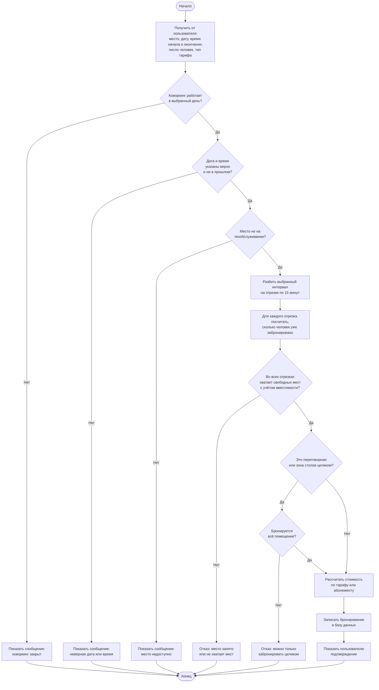
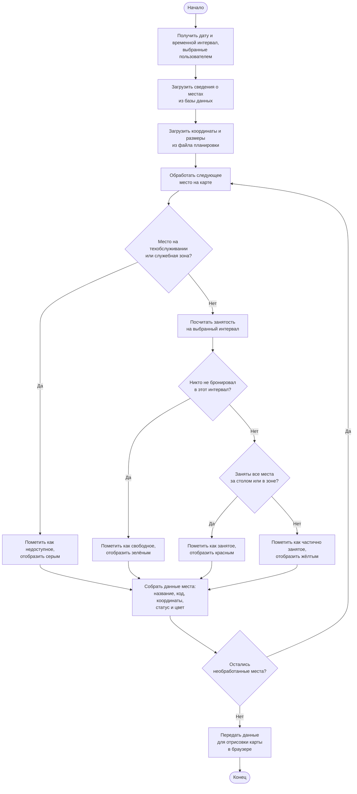
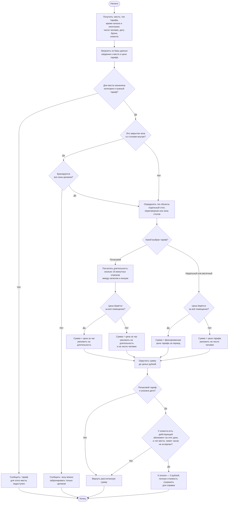
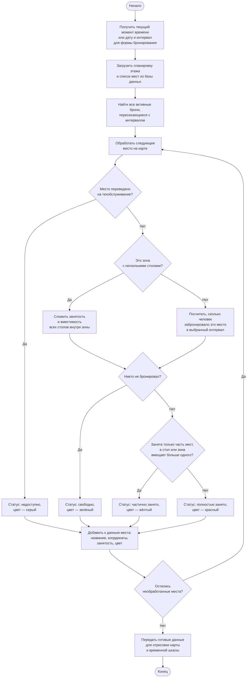

# Блок-схемы основных алгоритмов §2.4

Блок-схемы описывают логику программы простым языком, без имён переменных и фрагментов кода. Не дублируют BPMN: там — действия людей, здесь — автоматические проверки и расчёты.

Перенос в Word: [draw.io](https://app.diagrams.net/) или [mermaid.live](https://mermaid.live) → PNG.

---

## Рисунок 20 — Алгоритм проверки доступности и оформления бронирования

**Назначение:** проверить, можно ли забронировать место на выбранное время, и сохранить бронь при успехе.  
**Связь с BPMN:** шаги «проверить доступность» и «сохранить бронь» процесса «Создание бронирования».

### Текст для пояснительной записки

Алгоритм запускается после выбора места на карте и указания даты, времени и числа человек. Система проверяет режим работы коворкинга, корректность даты и времени, доступность места. Запрошенный интервал разбивается на 15-минутные отрезки; для каждого определяется занятость. Если во всех отрезках достаточно свободных мест, рассчитывается стоимость и сохраняется бронь. При нарушении любого условия пользователь получает сообщение с причиной отказа.

---

## Рисунок 21 — Алгоритм формирования данных интерактивной карты

**Назначение:** подготовить актуальные сведения о местах для отображения на карте.  
**Связь с BPMN:** обновление карты после бронирования и при загрузке страницы.

### Текст для пояснительной записки

Алгоритм выполняется при загрузке карты и при смене даты или времени. Система объединяет сведения о местах из базы данных с геометрией из файла планировки. Для каждого объекта определяется занятость: техобслуживание — серый цвет; свободно — зелёный; занята часть мест — жёлтый; всё занято — красный. Результат передаётся для отрисовки карты и списка доступного времени.

---

## Рисунок 22 — Алгоритм расчёта стоимости бронирования

**Назначение:** вычислить сумму к оплате перед сохранением брони или для показа в форме.  
**Связь с BPMN:** шаг «рассчитать стоимость» процесса «Создание бронирования».

### Текст для пояснительной записки

Алгоритм запускается после проверки доступности или при изменении параметров в форме бронирования. Система определяет тип объекта — стол, переговорную или зону — и выбирает формулу. Для почасового тарифа длительность считается через 15-минутные отрезки. Для переговорных и зон цена берётся за всё помещение; для столов умножается на число человек. При действующем абонементе сумма к оплате обнуляется.

---

## Рисунок 23 — Алгоритм определения статуса места на интерактивной карте

**Назначение:** определить, свободно ли место, и каким цветом его показать на карте.  
**Связь с BPMN:** шаг «обновить карту» после бронирования и при загрузке страницы.

### Текст для пояснительной записки

Алгоритм выполняется при каждой загрузке карты и при обновлении временной шкалы в форме бронирования. Система объединяет планировку с данными из базы и считает, сколько человек уже забронировало каждое место. Для зон с несколькими столами занятость суммируется по всем столам внутри. По результату место помечается как свободное (зелёный), частично занятое (жёлтый), полностью занятое (красный) или недоступное из‑за техобслуживания (серый).

---

## Краткое отличие от BPMN

| BPMN «Создание бронирования» | Алгоритм (рис. 20) |
|------------------------------|---------------------|
| Клиент выбирает место на карте | — |
| Клиент нажимает «Забронировать» | — |
| Система проверяет доступность | Разбиение на отрезки, подсчёт занятости, проверка вместимости |
| Система сохраняет бронь | Расчёт стоимости, запись в базу данных |

| BPMN «обновить карту» | Алгоритм (рис. 21, 23) |
|-----------------------|---------------------|
| Система обновляет карту | Загрузка данных, определение статуса каждого места, передача в браузер |

| BPMN «рассчитать стоимость» | Алгоритм (рис. 22) |
|-----------------------------|---------------------|
| Система рассчитывает стоимость | Выбор формулы по типу места и тарифу, проверка абонемента |
