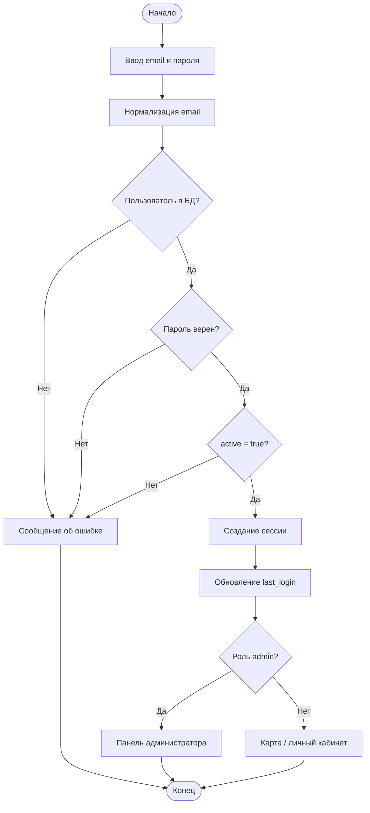
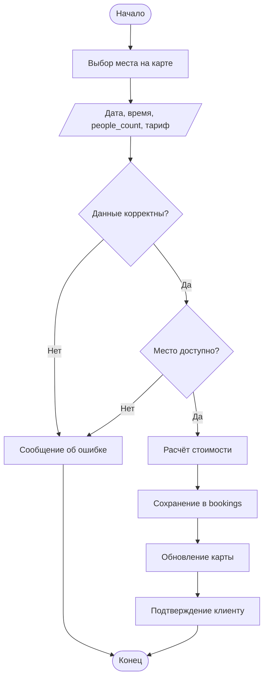
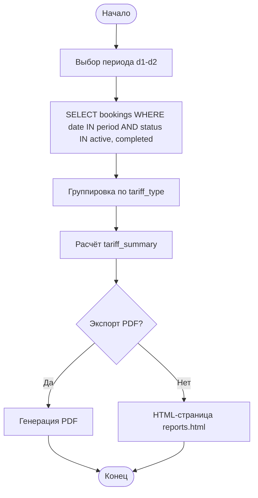

# 2.4. Разработка алгоритмов функционирования ПО (текст для пояснительной записки)

Для обеспечения корректной работы веб-приложения «Умный Коворкинг» разработаны алгоритмы основных компонентов: аутентификации, создания бронирования, проверки доступности места, формирования отчётов и учёта посетителей. BPMN-диаграммы процессов приведены в каталоге `docs/design/bpmn/` (см. `README.md`).

Ниже — текстовое описание алгоритмов в формате, пригодном для раздела 2.4 дипломной работы. Схемы можно построить в draw.io по аналогии с блок-схемами (овал «Начало/Конец», прямоугольник «процесс», ромб «решение», параллелограмм «ввод данных»).

---

## 2.4.1. Алгоритм аутентификации пользователя

Алгоритм аутентификации предназначен для проверки учётных данных и предоставления доступа к функциям системы в соответствии с ролью пользователя.

Работа алгоритма начинается с открытия пользователем страницы входа. Пользователь вводит адрес электронной почты и пароль, после чего нажимает кнопку «Войти».

Система нормализует email (приведение к нижнему регистру, удаление пробелов) и выполняет поиск записи в таблице `users`. Если пользователь не найден, отображается сообщение об ошибке и процесс завершается.

При успешном поиске система сравнивает введённый пароль с хэшем, сохранённым в базе данных (функция Werkzeug PBKDF2). При несовпадении пароля пользователю выводится сообщение об ошибке.

Если пароль верен, система проверяет флаг активности учётной записи (`active = true`). Для заблокированных пользователей доступ запрещается.

При успешной проверке создаётся сессия Flask-Login, обновляется поле `last_login`, выполняется перенаправление: администратор — в панель управления, клиент — на карту мест или личный кабинет.

**Схема алгоритма** — блок-схема с ромбами «Пользователь найден?», «Пароль верен?», «Аккаунт активен?»; соответствует BPMN «Вход в систему» (`BPMN-login.drawio`).

---

## 2.4.2. Алгоритм создания бронирования

Алгоритм создания бронирования обеспечивает резервирование рабочего места клиентом через интерактивную карту.

Пользователь открывает экран «Карта мест», выбирает объект, указывает дату, временной интервал, **число человек в брони** (сколько мест за столом, поле `people_count`) и тип тарифа, после чего нажимает «Забронировать».

Система проверяет корректность введённых данных: непустые поля, допустимая длительность для почасового тарифа (от 30 минут до 8 часов), число человек не превышает вместимость места.

Далее выполняется проверка доступности: для каждого 15-минутного слота суммируется **число человек** по существующим броням; новая бронь допустима, если $s_i + p \leq C$, где $C$ — **вместимость** места, $p$ — сколько человек бронирует клиент.

При ошибке проверки процесс завершается отказом с текстом причины. При успехе рассчитывается стоимость (почасовая, недельная, месячная или списание с абонемента), формируется запись в таблице `bookings`, обновляется отображение карты, клиенту выводится подтверждение.

**Схема алгоритма** — соответствует BPMN «Создание бронирования» (`BPMN-create-booking.drawio`).

---

## 2.4.3. Алгоритм проверки доступности и формирования временной сетки

Алгоритм разбивает рабочий день на слоты по 15 минут и определяет, можно ли разместить новую бронь на $p$ человек.

**Вход:** `place_id`, `booking_date`, `start_time`, `end_time`, `people_count`.

1. Получить расписание коворкинга на день недели: $T_{open}$, $T_{close}$.
2. Вычислить число слотов: $N_{slots} = \lfloor (T_{close} - T_{open}) / \Delta t \rfloor$, $\Delta t = 15$ мин.
3. Для каждого слота $i$ вычислить занятость $s_i = \sum_{b \in B_i} p_b$.
4. Если для всех слотов интервала выполняется $s_i + p \leq C$, вернуть `available = true`.

Результат используется API `/api/available_times` и модулем бронирования на карте.

---

## 2.4.4. Алгоритм формирования отчёта за период

Алгоритм формирования отчёта предназначен для агрегирования данных о бронированиях и экспорта результата администратору.

Администратор открывает раздел «Отчёты», выбирает период (дата начала и окончания) и нажимает «Сформировать» или «Экспорт PDF».

Система выполняет выборку из таблицы `bookings` с фильтром по дате и статусам `active`, `completed`. Бронирования группируются по типу тарифа: почасовые, по абонементу, недельные, месячные.

Для каждой группы формируется таблица с колонками: место, клиент, дата, длительность или срок, стоимость. Рассчитываются сводные показатели: число броней, выручка, сумма часов, посетителей.

Результат отображается на веб-странице или сериализуется в PDF (ReportLab) с переносом длинных строк.

**Схема алгоритма** — соответствует BPMN «Формирование и экспорт отчёта» (`BPMN-report.drawio`).

---

## 2.4.5. Алгоритм учёта посетителей коворкинга

Алгоритм учёта посетителей суммирует по каждой брони поле **«число человек в брони»** (`people_count`) — сколько человек клиент указал при бронировании (1, 2, 3… за одним столом).

За период $[d_1, d_2]$ общее число посетителей:

$$
N_{people} = \sum_{b \in B} b.people\_count
$$

где $B$ — множество броней со статусами `active` и `completed`.

Для построения графика «Посетители по дням» для каждой даты $d$ вычисляется $N_{people}(d)$ — сумма `people_count` всех броней с `booking_date = d`.

Аналогично для графика «Пиковые часы» суммируется `people_count` по часу начала брони (`start_time`).

Данный показатель отражает, **сколько человек фактически приходило в коворкинг** по оформленным броням, в отличие от процентной «загрузки мест по часам», которая в интерфейсе не используется.

---

## Соответствие BPMN и алгоритмов

| Алгоритм (раздел 2.4) | BPMN-диаграмма | Реализация |
|----------------------|----------------|------------|
| 2.4.1 Аутентификация | BPMN-login | `auth_handlers.py` |
| 2.4.2 Создание брони | BPMN-create-booking | `booking_service.py`, `booking_handlers.py` |
| 2.4.3 Временная сетка | — | `booking_service.py` |
| 2.4.4 Отчёт | BPMN-report | `admin_pages_handlers.py`, `report_handlers.py` |
| 2.4.5 Посетители | — | `admin_pages_handlers.py` (statistics) |

Полный перечень BPMN (13 процессов): регистрация, отмена, продление, техобслуживание, редактор мест, рейтинг, абонемент, тариф, уведомления — см. `docs/design/bpmn/README.md`.
