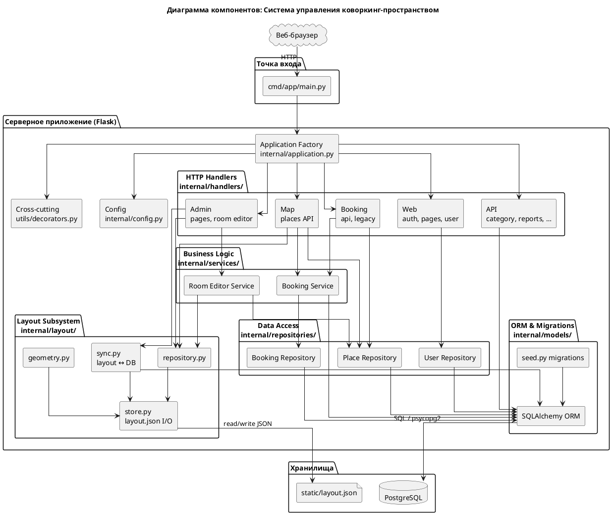

# Диаграмма компонентов системы

## UML Component Diagram



---

## Описание компонентов

| Компонент | Исходные файлы | Назначение |
|-----------|----------------|------------|
| **Entry Point** | `cmd/app/main.py` | Запуск сервера, инициализация БД при первом старте. |
| **Application Factory** | `internal/application.py` | Создание Flask-приложения, Flask-Login, регистрация всех маршрутов. |
| **Config** | `internal/config.py` | Параметры PostgreSQL, SECRET_KEY, пул соединений. |
| **Web Handlers** | `internal/handlers/web/` | Публичные страницы, вход/регистрация, личный кабинет. |
| **Map Handlers** | `internal/handlers/map/places.py` | API `/api/places` — объединение layout.json и данных PostgreSQL для SVG-карты. |
| **Booking Handlers** | `internal/handlers/booking/` | REST API бронирования: timegrid, check, create, cancel, extend. |
| **Admin Handlers** | `internal/handlers/admin/` | HTML-страницы админ-панели, редактор планировки (`room.py`). |
| **API Handlers** | `internal/handlers/api/` | Категории, зоны локаций, тарифы, абонементы, уведомления, отчёты, расписание. |
| **Auth (cross-cutting)** | `internal/utils/decorators.py`, Flask-Login | Декораторы `admin_required`, `staff_required`, `manager_required`. |
| **Booking Service** | `internal/services/booking_service.py` | 15-минутная сетка, проверка доступности, расчёт стоимости, абонементы. |
| **Room Editor Service** | `internal/services/room_editor_service.py` | Логика редактора: размещение объектов, валидация геометрии. |
| **Repositories** | `internal/repositories/` | Доступ к PostgreSQL: пользователи, места, бронирования. |
| **Layout Store** | `internal/layout/store.py` | Чтение/запись `layout.json`, стены, двери, кеш. |
| **Layout Geometry** | `internal/layout/geometry.py` | Проверка пересечений, границы этажа, проекция координат. |
| **Layout Sync** | `internal/layout/sync.py` | Синхронизация кодов мест, родительских связей layout ↔ БД. |
| **Layout Repository** | `internal/layout/repository.py` | Фасад над `store.py` для handlers и services. |
| **ORM & Migrations** | `internal/models/`, `internal/models/seed.py` | SQLAlchemy-модели, миграции, начальные данные. |
| **Layout Storage** | `static/layout.json` | Геометрия: `places[]`, `walls[]`, `doors[]`. |
| **PostgreSQL** | — | Пользователи, брони, тарифы, категории, расписания. |

---

## Клиентские модули (JavaScript)

| Файл | Назначение |
|------|------------|
| `static/js/map_updated.js` | SVG-карта: загрузка `/api/places`, отрисовка этажей, выбор места |
| `static/js/booking.js` | Форма бронирования: timegrid, проверка, создание брони |
| `static/js/editor/app.js` | Редактор планировки: drag-and-drop, стены, сохранение |
| `static/js/main.js` | Общий UI: уведомления, навигация |
| `static/js/notify.js` | Polling уведомлений для авторизованных пользователей |

---

## Прототипы интерфейса (основные экраны)

Подробные текстовые описания каждого экрана (для подписей к рисункам 10–24) — в **`docs/Implementation-3.3.md`**, раздел 3.3.

| № рис. | Экран | URL | Шаблон | Аудитория |
|--------|-------|-----|--------|-----------|
| 10 | Вход | `/login` | `login.html` | Все |
| 11 | Регистрация | `/register` | `register.html` | Гость |
| 12 | Главная | `/` | `index.html` | Гость |
| 13 | Карта + бронирование | `/mapp` | `mapp.html` | Клиент, менеджер |
| 14 | Личный кабинет | `/dashboard` | `dashboard.html` | Клиент |
| 15 | Админ-панель | `/admin` | `admin/admin.html` | Администратор |
| 16 | Редактор планировки | `/admin/editor` | `editor.html` | Администратор |
| 17 | Пользователи | `/admin/users` | `admin/admin_users.html` | Администратор |
| 18 | Бронирования (админ) | `/admin/bookings` | `admin/admin_bookings.html` | Админ, менеджер |
| 19 | Категории мест | `/admin/categories` | `admin/categories.html` | Администратор |
| 20 | Тарифы | `/admin/tariffs` | `admin/tariffs.html` | Администратор |
| 21 | Абонементы | `/admin/subscriptions` | `admin/subscriptions.html` | Админ, менеджер |
| 22 | Расписание | `/admin/schedule` | `admin/schedule.html` | Администратор |
| 23 | Отчёты | `/admin/reports` | `admin/reports.html` | Администратор |
| 24 | Уведомления | `/admin/notifications` | `admin/notifications_send.html` | Админ, персонал |

---

## Интерфейсы и зависимости

### Интерфейсы между компонентами

| Провайдер | Интерфейс | Потребитель | Описание |
|-----------|-----------|-------------|----------|
| **Handlers** | HTTP endpoints (`/api/*`, `/login`, `/dashboard`) | Веб-браузер | REST API и SSR-шаблоны Jinja2 |
| **Map Handlers** | `GET /api/places` → JSON | `map_updated.js` | Места + стены + двери + статусы |
| **Booking Handlers** | `GET /api/booking/timegrid`, `POST /api/booking/create` | `booking.js` | Сетка слотов и создание брони |
| **Layout Repository** | Python-функции (`load`, `save_place_geometry`) | Handlers, Services | Абстракция над layout.json |
| **Layout Sync** | `sync_place_by_code()`, `apply_place_location_zone()` | Admin, Editor | Согласование JSON и PostgreSQL |
| **Booking Service** | `get_timegrid_for_place()`, `create_booking()` | Booking Handlers | Бизнес-логика бронирования |
| **Repositories** | SQLAlchemy queries | Services, Handlers | CRUD над ORM-моделями |
| **ORM** | `db.session`, `Model.query` | Repositories, Services | Единый доступ к PostgreSQL |
| **Auth** | `current_user`, `@login_required`, `@admin_required` | Все handlers | Проверка аутентификации и ролей |

### Направление зависимостей

```
Browser → cmd/app/main.py → application.py → handlers/
handlers/ → services/ → repositories/ → models/ → PostgreSQL
handlers/map/ → layout/repository.py → layout/store.py → layout.json
handlers/admin/room.py → layout/sync.py → models/ (PostgreSQL)
```

- **Handlers** не обращаются к БД напрямую там, где есть сервис или репозиторий; исключения — простые страницы админки.
- **Layout subsystem** — единственный компонент, работающий с файловым хранилищем геометрии.
- **Auth** — сквозной компонент: декораторы используются во всех защищённых маршрутах.

### Политика данных

| Сущность | Поведение |
|----------|-----------|
| Пользователи | Блокировка (`active = FALSE`), физическое удаление запрещено |
| Места | Снятие с карты (`active = FALSE` + удаление из layout.json), строка в `places` сохраняется |
| Бронирования | Только смена статуса (`active` → `cancelled` / `completed`), удаление запрещено |

---

## Структура каталогов (актуальная)

```text
cmd/app/main.py
internal/
  application.py, config.py
  layout/          store.py, geometry.py, sync.py, repository.py
  models/          ORM-модели, db.py, seed.py
  handlers/
    web/           pages, auth, user
    map/           places
    booking/       api, legacy
    admin/         pages, bookings, places, room
    api/           category, report, subscription, …
    deps.py
  services/        booking_service, room_editor_service
  repositories/    booking, place, user
  utils/           decorators, formatters, paths
static/
  layout.json
  js/              map_updated.js, booking.js, editor/app.js
templates/         HTML-прототипы всех экранов
tests/
```
